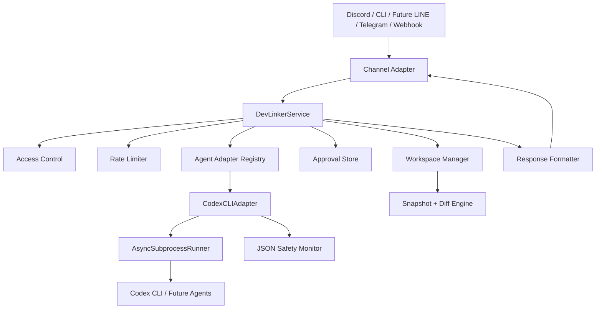

# DevLinker

DevLinker is a modular Python bridge for multi-channel AI coding workflows. It receives prompts from channels such as Discord, executes them through an external coding agent such as Codex CLI, captures output and file changes, and returns a safe, channel-friendly response.

DevLinker คือ modular Python bridge สำหรับงาน AI coding assistant แบบหลายช่องทาง รองรับการรับ prompt จากช่องทางอย่าง Discord ส่งต่อไปยัง coding agent ภายนอกอย่าง Codex CLI เก็บผลลัพธ์และการเปลี่ยนแปลงไฟล์ แล้วส่งคำตอบกลับอย่างปลอดภัยและเหมาะกับแต่ละช่องทาง

English: This README is bilingual.  
ไทย: README นี้เป็นสองภาษา

ดูคู่มือภาษาไทยแบบสรุปเพิ่มได้ที่ [docs/THAI_GUIDE.md](docs/THAI_GUIDE.md)

## Architecture / สถาปัตยกรรม



## Directory Tree / โครงสร้างโปรเจ็กต์

```text
DevLinker/
├── .env.example
├── .gitignore
├── LICENSE
├── README.md
├── config.example.yaml
├── docs/
│   └── THAI_GUIDE.md
├── devlinker/
│   ├── __init__.py
│   ├── __main__.py
│   ├── app.py
│   ├── bootstrap.py
│   ├── logging.py
│   ├── settings.py
│   ├── application/
│   │   ├── auth.py
│   │   ├── rate_limit.py
│   │   ├── service.py
│   │   └── workspace.py
│   ├── domain/
│   │   ├── enums.py
│   │   ├── errors.py
│   │   ├── models.py
│   │   └── ports.py
│   └── infrastructure/
│       ├── agents/
│       │   ├── codex_cli.py
│       │   ├── process.py
│       │   └── safety.py
│       ├── channels/
│       │   └── discord_adapter.py
│       ├── formatters/
│       │   ├── discord_formatter.py
│       │   └── text_formatter.py
│       └── persistence/
│           └── approval_store.py
├── pyproject.toml
├── requirements.txt
├── tests/
│   ├── fakes.py
│   ├── test_codex_cli.py
│   ├── test_discord_formatter.py
│   ├── test_service.py
│   ├── test_settings.py
│   └── test_workspace.py
└── workspace/
    └── .gitkeep
```

## Key Components / ส่วนประกอบสำคัญ

- `devlinker/settings.py`: Loads `config.yaml` and `.env`, normalizes runtime settings, and prepares working directories. โหลด `config.yaml` และ `.env`, จัดรูปค่า config และสร้าง working directories ที่จำเป็น
- `devlinker/application/service.py`: Main orchestration layer for `/forge`, `/approve`, and `/reject`. เป็น orchestration หลักสำหรับ `/forge`, `/approve`, และ `/reject`
- `devlinker/application/workspace.py`: Manages live/preview workspaces and computes diffs without requiring a git repo. จัดการ live/preview workspace และคำนวณ diff ได้แม้ไม่มี git repo
- `devlinker/infrastructure/agents/codex_cli.py`: Runs `codex exec`, streams output, checks safety rules, and captures final results. เรียก `codex exec`, stream output, ตรวจ safety rules และเก็บผลลัพธ์สุดท้าย
- `devlinker/infrastructure/channels/discord_adapter.py`: Registers Discord slash commands and sends progress plus final replies. ลงทะเบียน slash commands ของ Discord และส่ง progress กับผลลัพธ์กลับ
- `devlinker/infrastructure/formatters/discord_formatter.py`: Splits long responses into Discord-safe chunks. ตัดข้อความยาวให้เหมาะกับข้อจำกัดของ Discord
- `devlinker/infrastructure/persistence/approval_store.py`: Stores pending approval requests in a JSON file. เก็บ approval requests ที่รออนุมัติไว้ในไฟล์ JSON

## Approval Modes / โหมดการอนุมัติ

- `manual`: Run inside a preview workspace first and require `/approve` before applying to the live workspace. รันใน preview workspace ก่อน และต้อง `/approve` ก่อน apply ไปยัง live workspace
- `auto`: Run directly in the live workspace. รันและแก้ไขใน live workspace ได้ทันที
- `never`: Preview only and never touch the live workspace. ดูผลแบบ preview อย่างเดียวและไม่แตะ live workspace

## Example Slash Command / ตัวอย่าง Slash Command

```text
/forge prompt:"สร้าง FastAPI CRUD สำหรับ todo list" agent:"codex" auto_approve:false dry_run:false
```

Manual mode flow:

1. Clone `./workspace` into `./.devlinker/previews/<request_id>`
2. Run Codex inside the preview copy
3. Return summary, final answer, and file diff preview
4. Wait for `/approve request_id:<id>` or `/reject request_id:<id>`

ลำดับการทำงานของ `manual` mode:

1. clone `./workspace` ไปที่ `./.devlinker/previews/<request_id>`
2. รัน Codex ใน preview copy
3. ส่ง summary, final answer และ diff preview กลับมา
4. รอ `/approve request_id:<id>` หรือ `/reject request_id:<id>`

## Installation / การติดตั้ง

Recommended Python version: `3.11+`  
เวอร์ชัน Python ที่แนะนำ: `3.11+`

```bash
python3.11 -m venv .venv
source .venv/bin/activate
pip install -e ".[dev]"
cp .env.example .env
cp config.example.yaml config.yaml
```

## Required Configuration / ค่าที่ควรตั้งอย่างน้อย

- `DISCORD_TOKEN`
- `DISCORD_ALLOWED_USER_IDS` or `DISCORD_ALLOWED_ROLE_IDS`
- `DEFAULT_AGENT`
- `WORKING_DIR`
- `APPROVAL_MODE`

ตัวอย่าง `.env`:

```dotenv
DISCORD_TOKEN=your_token
DISCORD_ALLOWED_USER_IDS=123456789012345678
DEFAULT_AGENT=codex
WORKING_DIR=./workspace
APPROVAL_MODE=manual
```

## Run / การรัน

Start the Discord bot / รัน Discord bot:

```bash
python -m devlinker bot
```

Run a one-off local job / รันทดสอบแบบ local:

```bash
python -m devlinker run-once --prompt "Refactor the todo service" --dry-run
```

Run tests / รันเทสต์:

```bash
pytest
```

## Extensibility / การต่อยอด

- Add a `LineAdapter` or `TelegramAdapter` by implementing `BaseChannelAdapter`. เพิ่ม `LineAdapter` หรือ `TelegramAdapter` ได้ด้วยการ implement `BaseChannelAdapter`
- Add `ClaudeCodeAdapter`, `GeminiCLIAdapter`, or `OllamaAdapter` by implementing `BaseAgentAdapter`. เพิ่ม agent ใหม่อย่าง `ClaudeCodeAdapter`, `GeminiCLIAdapter`, หรือ `OllamaAdapter` ได้ด้วยการ implement `BaseAgentAdapter`
- Add FastAPI webhook endpoints as another channel adapter. เพิ่ม FastAPI webhook เป็น channel adapter อีกตัวได้
- Persist run history and audit logs in SQLite or Postgres. เก็บประวัติการรันและ audit logs ลง SQLite หรือ Postgres ได้
- Add a web dashboard for approvals and job history. เพิ่ม web dashboard สำหรับ approvals และประวัติการรันได้

## Notes / หมายเหตุ

- The current implementation includes Discord plus a local CLI entrypoint. เวอร์ชันปัจจุบันมี Discord และ local CLI entrypoint แล้ว
- Real Discord deployment still requires valid token, Discord app setup, and Codex authentication on the host machine. การ deploy จริงบน Discord ยังต้องมี token ที่ถูกต้อง, ตั้งค่า Discord app, และ login Codex บนเครื่องที่รัน
- For a Thai-first walkthrough, see [docs/THAI_GUIDE.md](docs/THAI_GUIDE.md). ถ้าต้องการคู่มือภาษาไทยแบบเน้นการใช้งาน ให้ดู [docs/THAI_GUIDE.md](docs/THAI_GUIDE.md)
